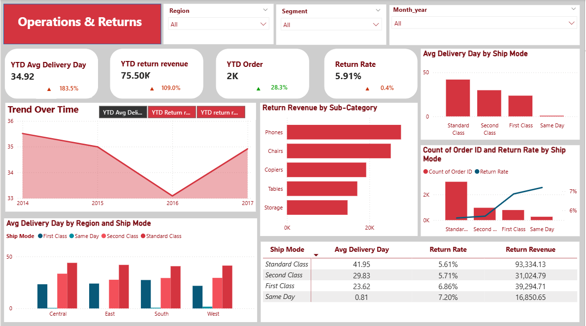
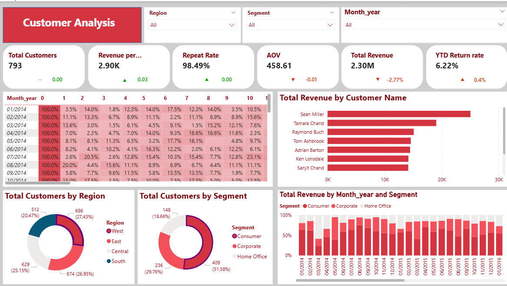
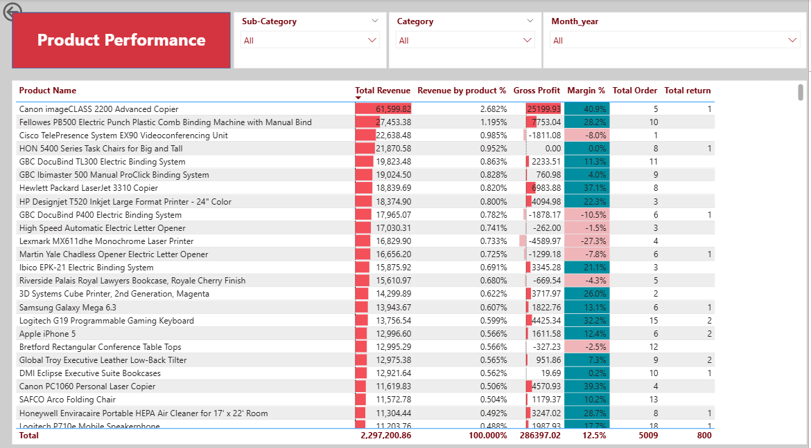

# Supply Chain & Sales Dashboard
## Tổng quan
Dự án phân tích dữ liệu bán lẻ nhằm khai thác insight về doanh thu, lợi nhuận, vận hành, khách hàng và sản phẩm.
Dashboard được thiết kế theo 4 page:

- Tổng quan điều hành (Executive)

- Vận hành & hoàn trả (Operations & Returns)

- Khách hàng (Customer)

- Sản phẩm (Product)
## Mục tiêu
Theo dõi KPI chính: Revenue, Profit, Margin, Orders, Return Rate

Phân tích hiệu suất giao hàng và tỷ lệ hoàn trả

Hiểu hành vi và đóng góp của khách hàng

Phát hiện sản phẩm doanh thu cao nhưng lợi nhuận thấp

## 1. Executive Overview

#### Analysis

- Doanh thu tăng đều qua các năm (2014–2017), cho thấy business đang mở rộng

- Tuy nhiên, chi phí tăng nhanh hơn, khiến biên lợi nhuận bị thu hẹp

- Doanh thu tập trung vào một số thành phố lớn (New York, Seattle, Los Angeles)

- Phân khúc Consumer chiếm tỷ trọng cao nhất

#### Key Insights

- Tăng trưởng hiện tại chưa bền vững do áp lực chi phí

- Doanh thu phụ thuộc nhiều vào một số market chính → rủi ro tập trung

- Consumer là driver chính của revenue

##### Recommendations

- Kiểm soát chi phí vận hành để cải thiện profit margin

- Mở rộng ở các khu vực tiềm năng để giảm phụ thuộc vào top cities

- Tập trung chiến lược marketing & retention vào Consumer segment
## 2. Operations & Returns

#### Analysis
- Thời gian giao hàng TB khá lâu và khác biệt rõ giữa các ship mode
  
- Same-day & First Class nhanh hơn nhưng có return rate cao hơn
  
- Một số danh mục sản phẩm (Phones, Chairs) có giá trị hoàn trả lớn

#### Key Insights
- Tồn tại trade-off giữa tốc độ giao hàng và tỷ lệ hoàn trả

- Return không chỉ là vấn đề logistics mà còn liên quan đến product expectation

- Return revenue tập trung ở một số sub-category chính
#### Recommendations
- Tối ưu lựa chọn ship mode theo từng loại sản phẩm (không áp dụng tất cả)

- Phân tích nguyên nhân return để giảm tỷ lệ hoàn trả
 
- Cần đánh giá và cân bằng giữa thời gian giao hàng và chi phí do hoàn trả, để tối ưu tổng chi phí vận hành.

## 3. Customer Analysis
  

#### Analysis
- Tỷ lệ khách hàng quay lại rất cao (~98%)

- Phân khúc Consumer đóng góp hơn 50% doanh thu
  
- Tỷ lệ quay lại của KH cao nhưng đến năm 2015 bắt đầu không ổn định và xu hướng giảm đến 2017 

- Một số khách hàng cá nhân mang lại doanh thu lớn (top customers)
#### Key Insights
- Business có customer loyalty tốt nhưng dần mất đi từ 2015 -2017 

- Revenue phụ thuộc nhiều vào Consumer segment và một nhóm khách hàng chính

- Có cơ hội khai thác thêm từ nhóm khách hàng hiện tại
#### Recommendations
- Xây dựng chương trình loyalty / upsell / cross-sell cho khách hàng hiện hữu

- Phân tích nguyên nhân tỷ lệ KH rời bỏ ngày càng nhiều 

- Giảm rủi ro bằng cách đa dạng hóa tệp khách hàng 

## 4. Product Performance
  
#### Analysis
- Một số sản phẩm có doanh thu cao nhưng margin thấp hoặc âm
  
- Lợi nhuận không phân bổ đều giữa các sản phẩm

- Một số sản phẩm đóng góp doanh thu nhỏ nhưng vẫn chiếm tài nguyên
#### Key Insights
- Không phải sản phẩm bán chạy nào cũng mang lại lợi nhuận

- Danh mục sản phẩm hiện tại có dấu hiệu chưa tối ưu về pricing & cost

- Cải thiện lợi nhuận thông qua việc tối ưu lại danh mục sản phẩm 
#### Recommendations
- Rà soát và điều chỉnh pricing strategy cho sản phẩm margin thấp

- Loại bỏ hoặc tối ưu các sản phẩm hiệu quả kém

- Tập trung vào nhóm sản phẩm high-margin & high-demand
